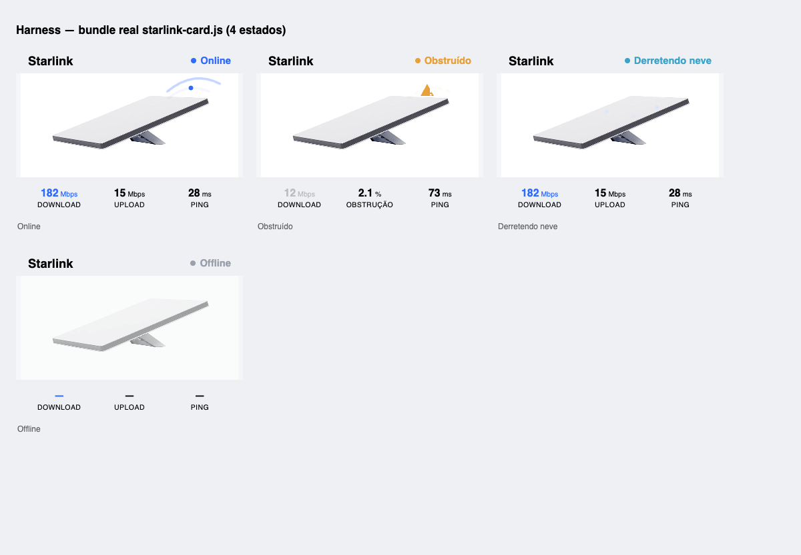

# Starlink Card

[](https://github.com/hacs/integration)
[](https://github.com/hudsonbrendon/starlink-card/releases)
[](LICENSE)

An animated Lovelace card for Home Assistant's **native [Starlink integration](https://www.home-assistant.io/integrations/starlink/)**, in the spirit of [vacuum-card](https://github.com/denysdovhan/vacuum-card). It shows your dish with a real product photo and reacts to the dish's live status — animated signal waves when online, an obstruction warning, snow-melt, sleep, stow and offline states.



## Features

- 📡 Real Starlink Standard dish artwork with **state-driven animations**
- 🟢 Online (animated signal), ⚠️ Obstructed, ❄️ Melting snow, 🔥 Overheating, 💤 Sleeping, 📦 Stowed, ⚪ Offline
- 📊 Live Download / Upload / Ping stats
- 🌐 English + Português (pt-BR), follows your HA language
- 🎛️ Visual (GUI) editor
- 🎨 Theme-aware (uses your HA theme colors)

## Installation

### HACS (recommended)

1. Open **HACS → Frontend**.
2. If not yet in the default store: **⋮ → Custom repositories**, add `https://github.com/hudsonbrendon/starlink-card`, category **Lovelace/Dashboard**.
3. Install **Starlink Card** and refresh.

### Manual

1. Download `starlink-card.js` from the [latest release](https://github.com/hudsonbrendon/starlink-card/releases).
2. Copy it to `config/www/`.
3. Add the resource under **Settings → Dashboards → Resources**:
   - URL `/local/starlink-card.js`, type **JavaScript Module**.

## Usage

Add the card via the dashboard UI (it appears as **Starlink Card**), or in YAML:

```yaml
type: custom:starlink-card
name: Starlink
entity: binary_sensor.starlink_connected
show_stats: true
show_buttons: false
```

The card auto-derives the other entities from the device of `entity`. If your
entity ids differ, set them explicitly:

```yaml
type: custom:starlink-card
name: Starlink
entities:
  connected: binary_sensor.starlink_connected
  obstructed: binary_sensor.starlink_obstructed
  heating: binary_sensor.starlink_heating
  thermal_throttle: binary_sensor.starlink_thermal_throttle
  sleep: binary_sensor.starlink_sleep
  stowed: switch.starlink_stowed
  download: sensor.starlink_downlink_throughput
  upload: sensor.starlink_uplink_throughput
  ping: sensor.starlink_ping
  ping_drop_rate: sensor.starlink_ping_drop_rate
  restart: button.starlink_restart
```

## Options

| Name           | Type    | Default      | Description                                              |
| -------------- | ------- | ------------ | -------------------------------------------------------- |
| `type`         | string  | **required** | `custom:starlink-card`                                   |
| `name`         | string  | `Starlink`   | Card title                                               |
| `entity`       | string  | _optional_   | Primary entity; anchors more-info and entity derivation  |
| `entities`     | object  | _optional_   | Explicit entity ids per role (see above)                 |
| `show_stats`   | boolean | `true`       | Show the Download / Upload / Ping footer                 |
| `show_buttons` | boolean | `false`      | Show the reboot button                                   |

### Status mapping

The displayed status is derived from the integration's entities (first match wins):
`unavailable → stowed → sleeping → offline → obstructed → overheating → melting snow → online`.

## Development

```bash
npm install
npm test        # unit tests (vitest)
npm run build   # bundles to starlink-card.js (artwork inlined)
npm start       # watch build
```

## License

MIT © [Hudson Brendon](https://github.com/hudsonbrendon)
